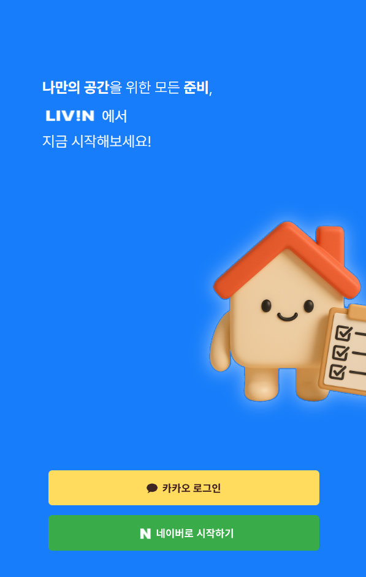

# LIVIN - 안전한 부동산 거래 도우미

안전하고 투명한 부동산 거래를 위해 **매물 위험도 분석, 맞춤형 체크리스트, 거래 가이드**를 제공하는 서비스입니다.

사용자는 **매물을 등록**하고 **위험도를 분석**할 수 있으며, **관심 매물 관리와 커스터마이징 체크리스트**를 통해 더 안전한 거래를 경험할 수 있습니다.

<div align="center">


</div>

## 📆프로젝트 기간

- 2025-07-09 ~ 2025-08-19

## ⚙️ 설치 및 실행

### Frontend (로컬 실행)

```bash
# 프로젝트 클론
git clone https://github.com/LIVIN-ORG/LIVIN-FE.git
cd LIVIN-FE

npm install
npm run dev
```

### Backend (로컬 실행)

```bash
# 프로젝트 클론
git clone https://github.com/LIVIN-ORG/LIVIN-BE.git
cd LIVIN-BE

# Gradle 빌드
./gradlew clean build

# Docker 실행
docker-compose -f docker/docker-compose.yml up -d
```

## 💻 주요 기능

<details>
<summary>소셜 로그인</summary>

> 카카오 · 네이버 OAuth2 소셜 로그인

<div align="center">

  
</div>
</details>
<br/>

<details>
<summary>매물 등록</summary>

> 임대인 매물 등록

<div align="center">

  
</div>
</details>
<br/>

<details>
<summary>위험도 분석</summary>

> 근저당권, 소유주와 임대인 일치 여부, 위반 건축물 여부, 전세가율로 매물의 위험도를 분석

<div align="center">


</div>
</details>
<br/>

<details>
<summary>체크리스트</summary>

> 매물의 확인하고 싶은 사항을 담는 체크리스트 생성  
> 나만의 항목을 생성하여 체크리스트 작성  
> 특정 체크리스트가 적용된 매물 조회 가능
<div align="center">


</div>
</details>
<br/>

<details>
<summary>안심 뱃지</summary>

> 안심 뱃지 클릭 시 위험도 분석 결과 제공
<div align="center">


</div>
</details>
<br/>

<details>
<summary>관심 매물 관리</summary>

> 매물 즐겨찾기 및 조회
<div align="center">


</div>
</details>

## 🛠️ 기술 스택

### Frontend


### Backend


### Infra & DevOps


### Design


### Documentation & Version Control


|

## 🚀 배포 구조

[](#)
[](#)
[](#)
[](#)

### 개요

> **Frontend** → Vercel **자동 배포**

> **Backend** → Docker 이미지 빌드 → **Docker Hub 푸시** → EC2에서 `docker-compose` **배포**

> **Cache/세션** → **Redis (Docker)**

## System Architecture


## ERD


## 👥 팀원

|               [배영현](https://github.com/Youngbae1126)               |               [강경림](https://github.com/KyungLim11)               |               [남정범](https://github.com/imnjb)               |               [양민영](https://github.com/Minyoung06)               |               [이유미](https://github.com/ll-04)               |                [장혁](https://github.com/jjang0308)                |               [전영태](https://github.com/JeonYeongtae)               |               [조아빈](https://github.com/whdkqls122)               |
| :-------------------------------------------------------------------: | :-----------------------------------------------------------------: | :------------------------------------------------------------: | :-----------------------------------------------------------------: | :------------------------------------------------------------: | :----------------------------------------------------------------: | :-------------------------------------------------------------------: | :-----------------------------------------------------------------: |
|  |  |  |  |  |  |  |  |
|                               FullStack                               |                              FullStack                              |                           FullStack                            |                              FullStack                              |                           FullStack                            |                             FullStack                              |                               FullStack                               |                              FullStack                              |

## 주요 링크

### 📑 Notion 문서

- [🌐 Notion 전체 문서 바로가기](https://www.notion.so/youngbae1126/KB-20-1-2253d9b5054a807694cfd743a6db482c)

### 🎨 디자인 시안

- [🖌️ Figma 바로가기](https://www.figma.com/design/CNyHyGkOsdD4HWwRa98waf/%EB%B0%A9%EA%B5%AC%EC%84%9D%EB%9E%A9--20%EB%B0%98-1%ED%8C%80--%ED%94%BC%EA%B7%B8%EB%A7%88?node-id=257-4636&p=f&t=QWnhw68SKXGqkiv1-0)
